# Nexora AI: INTERACTIVE USER INTERFACE GALLERY V2
## Comprehensive Walkthrough of Layout Themes, Pages, and Viewports

---

### INTRODUCTION
This v2 document compiles the complete UI layouts of the Nexora AI response interface, showcasing all desktop pages and responsive mobile viewports. It documents all 6 active preset theme styles supported by the console (Midnight Dark, Light Theme, Cyber Purple, Emerald Green, Sunset Orange, Custom Color) showing side-by-side prompt broadcasts.

---

### 1. SECURE AUTHENTICATION PORTAL (MIDNIGHT DARK ONLY)

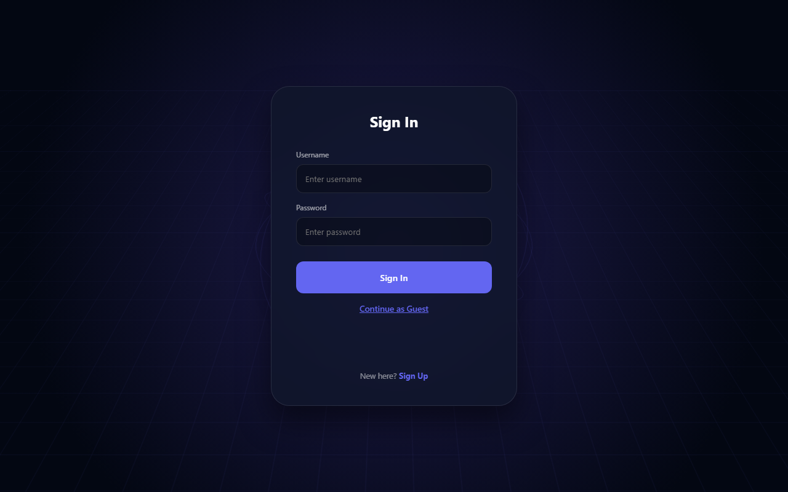
*Figure 1.1: Secure Sign-In Portal*

**Description of Visible Elements:**
* **Login Form Card**: Holds input text fields for username and credentials.
* **Guest Entry Link**: Bypasses active database authentication to instantly redirect the user context into the main workspace.

---

### 2. CORE WORKSPACE THEME VARIATIONS (SHOWCASE)

This section showcases the main broadcast workspace in every possible theme variation:

#### A. LIGHT THEME (BULB ACTIVE)
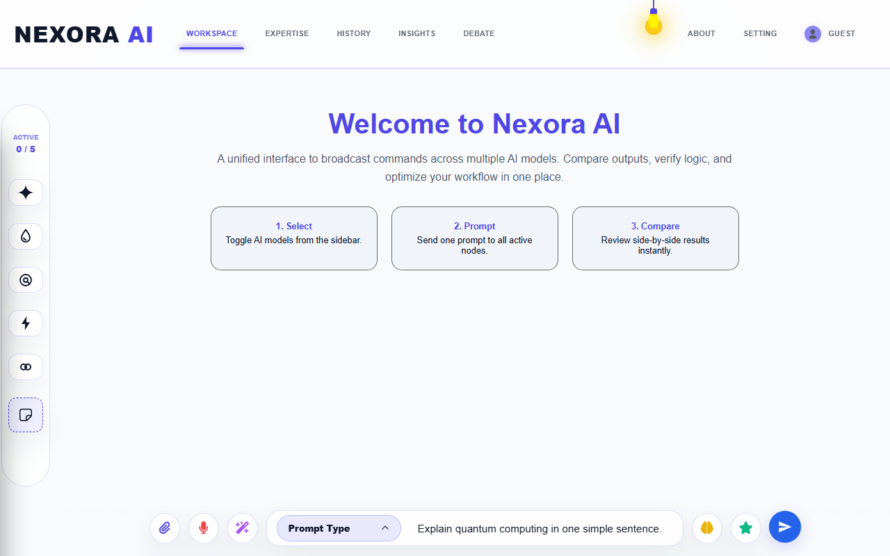
*Figure 2.1: Workspace Active Broadcast in Light Theme*
* **Aesthetics**: Clean, soft off-white background with a glowing hanging lightbulb.

#### B. MIDNIGHT DARK THEME
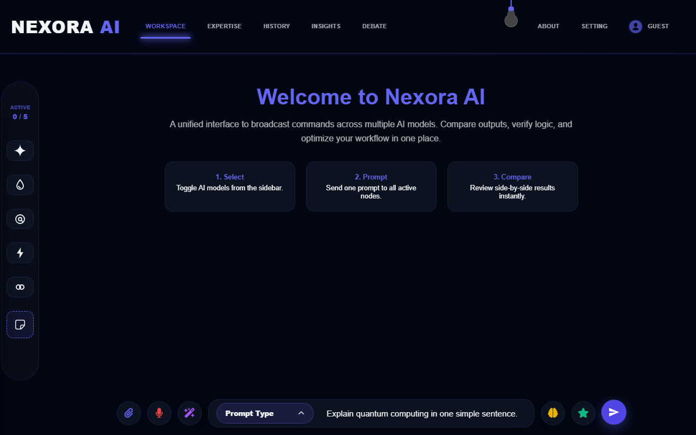
*Figure 2.2: Workspace Active Broadcast in Midnight Dark Theme*
* **Aesthetics**: Deep dark-blue gradients with matching neon-blue cards and buttons.

#### C. CYBER PURPLE THEME
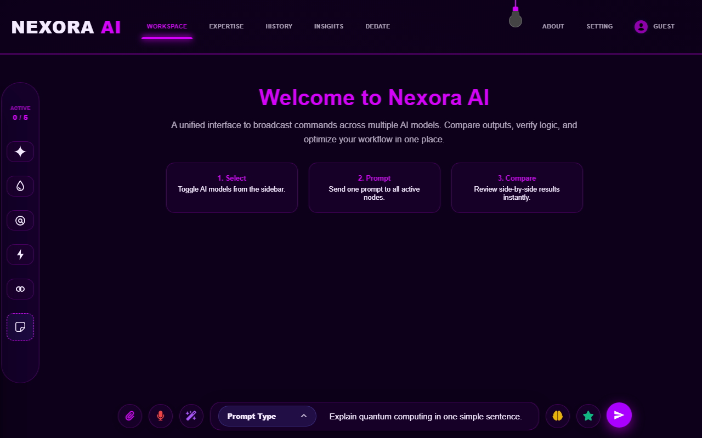
*Figure 2.3: Workspace Active Broadcast in Cyber Purple Theme*
* **Aesthetics**: Cyberpunk violet accents with glowing dark-magenta panels and borders.

#### D. EMERALD GREEN THEME
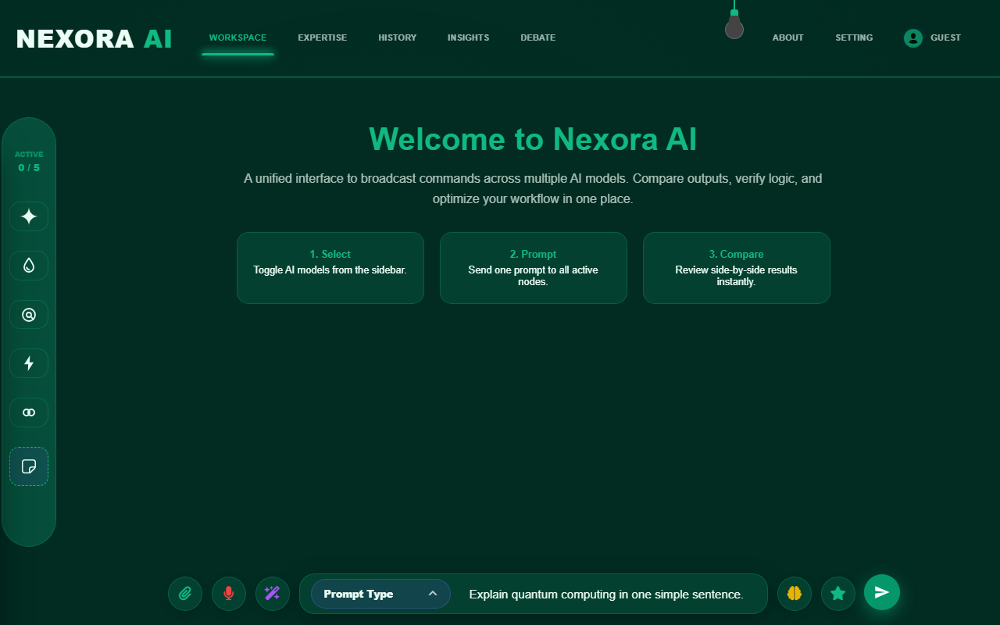
*Figure 2.4: Workspace Active Broadcast in Emerald Green Theme*
* **Aesthetics**: Forest-green workspace gradients matched with bright emerald accents and borders.

#### E. SUNSET ORANGE THEME
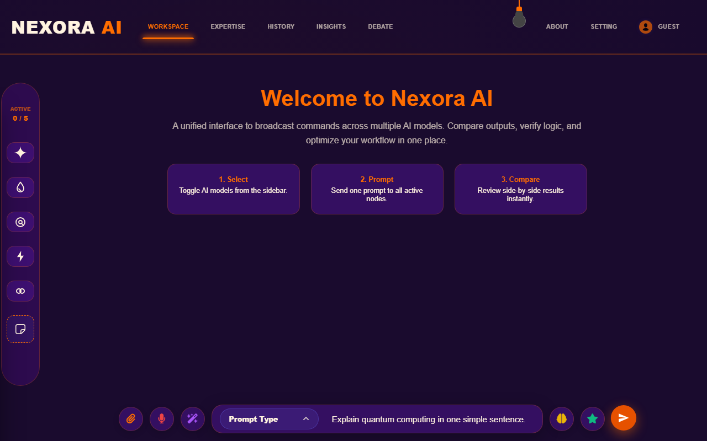
*Figure 2.5: Workspace Active Broadcast in Sunset Orange Theme*
* **Aesthetics**: Evening purple backdrop matched with vibrant sunset-orange button states and glowing highlights.

#### F. CUSTOM COLOR THEME
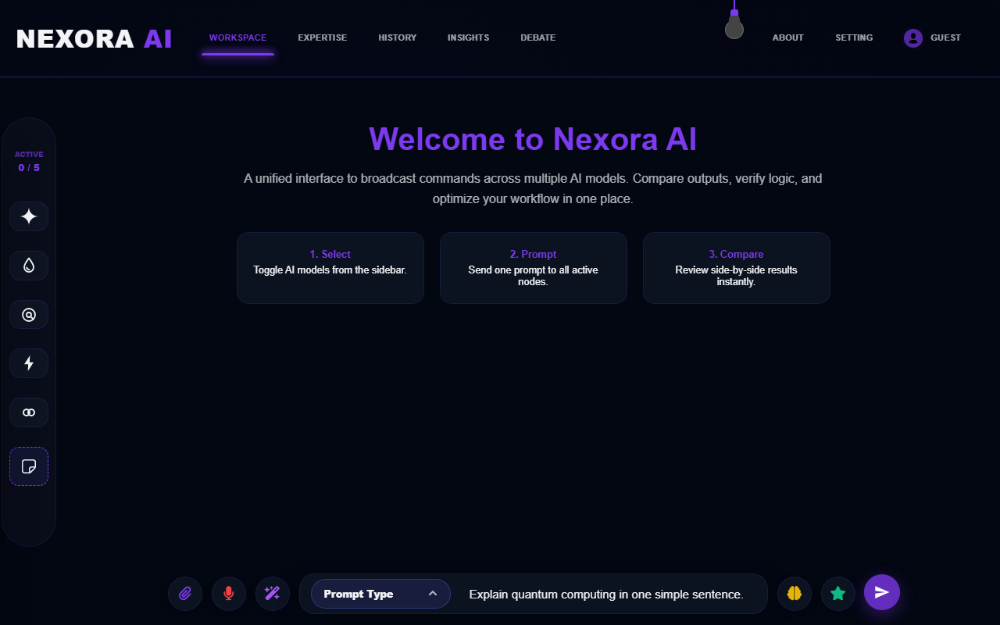
*Figure 2.6: Workspace Active Broadcast in Custom Color Theme*
* **Aesthetics**: Standard custom violet/lavender highlight presets for personalized user selections.

---

### 3. MODEL EXPERTISE PERSONA CUSTOMIZER (LIGHT MODE)

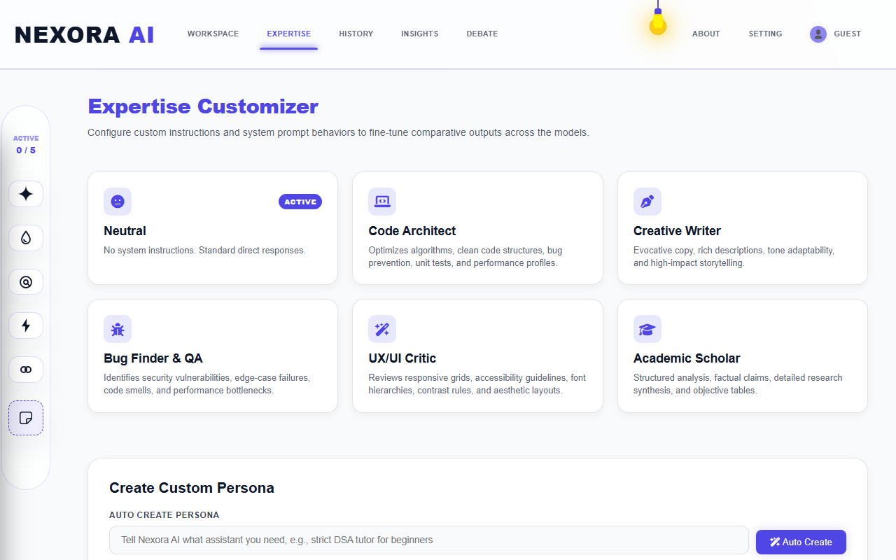
*Figure 3.1: Model System Instructions Configurator (Light Mode)*

**Description of Visible Elements:**
* **Custom Presets**: Cards mapping built-in steerable system instructions (e.g. Code helper, general assistant).
* **System Prompt editors**: Allows inline adjustments to shape comparative behaviors.

---

### 4. SESSION HISTORY DIRECTORY (LIGHT MODE)

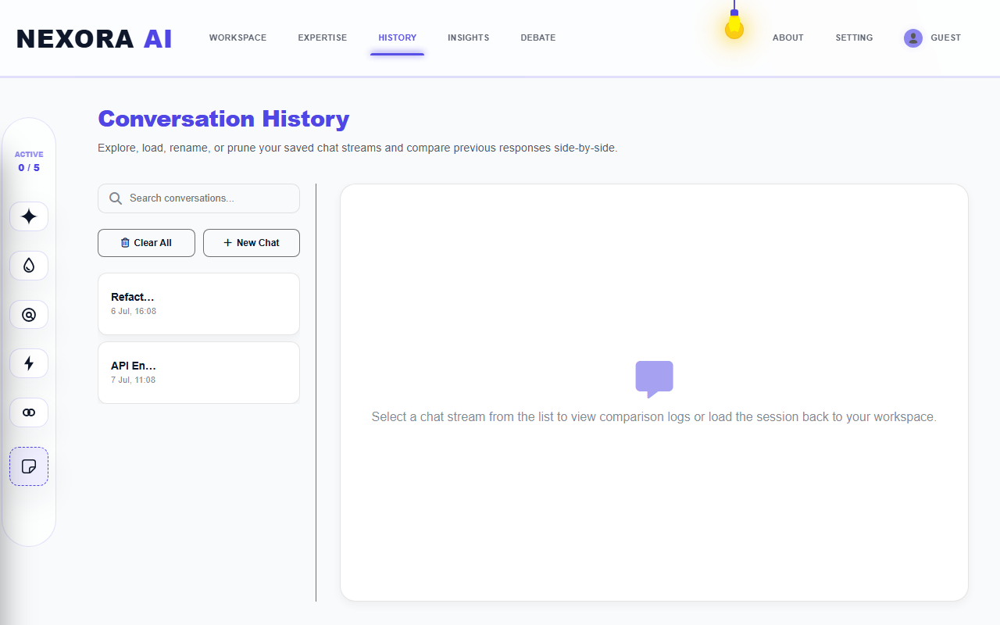
*Figure 4.1: Conversations Log Directory (Light Mode)*

**Description of Visible Elements:**
* **Past Logs**: Lists past prompts and target models sorted chronologically.
* **Database sync**: Integrated Mongoose bulkWrite sync.

---

### 5. INSIGHTS ANALYTICS DASHBOARD (LIGHT MODE)

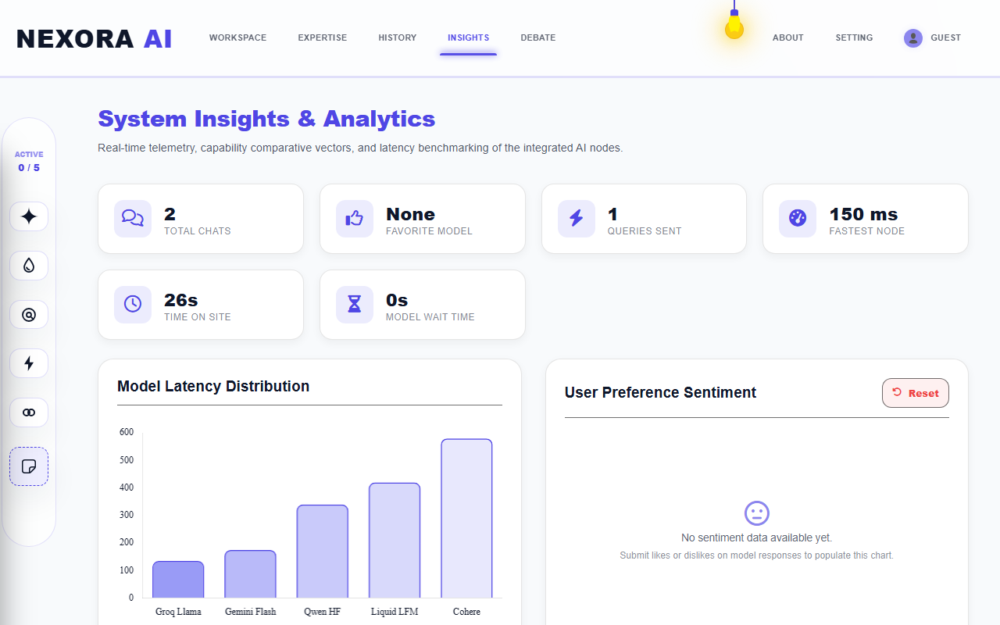
*Figure 5.1: Insights Analytics Dashboard (Light Mode)*

**Description of Visible Elements:**
* **Feedback Sentiment Dial**: Interactive donut chart grouping voting stats (likes/dislikes).
* **Average Speed metrics**: Chart.js lines plotting response latencies over time.

---

### 6. MULTI-TURN DEBATE ARENA (LIGHT MODE)

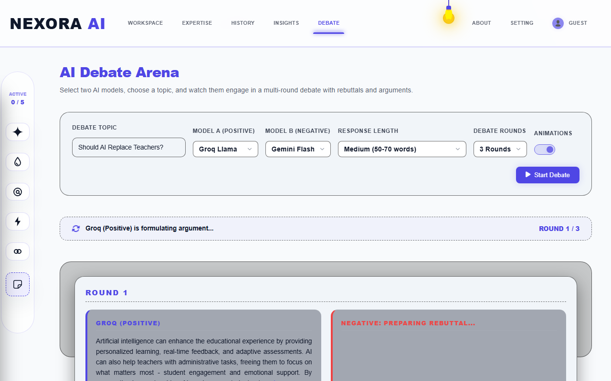
*Figure 6.1: Multi-Turn AI Debate Arena (Light Mode)*

**Description of Visible Elements:**
* **Active Debate Bubbles**: Shows parallel statements traded between Model A and Model B.
* **Consensus Judge panel**: Automatically parses debate statements to show a summarized outcome.

---

### 7. SYSTEM CONFIGURATION & BYOK CREDENTIALS (LIGHT MODE)

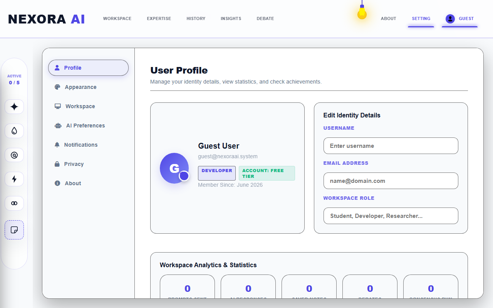
*Figure 7.1: General Settings Configuration (Light Mode)*

**Description of Visible Elements:**
* **BYOK Credentials Input**: Form boxes to save custom developer API keys.
* **Account details**: Manages profile avatars.

---

### 8. RESPONSIVE MOBILE VIEWPORT (LIGHT MODE)

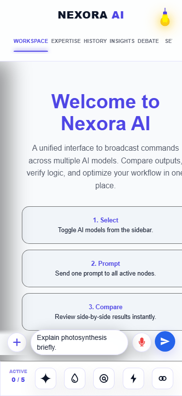
*Figure 8.1: Mobile responsive workspace active output (Light Mode)*

**Description of Visible Elements:**
* **Bottom sticky drawer**: Houses voice speech triggers and command textareas.
* **Vertical card stack**: Stacks comparative answer panels cleanly on mobile viewports.
