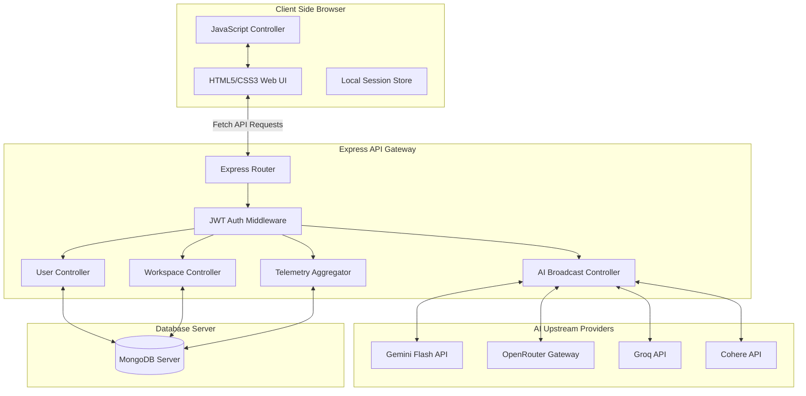
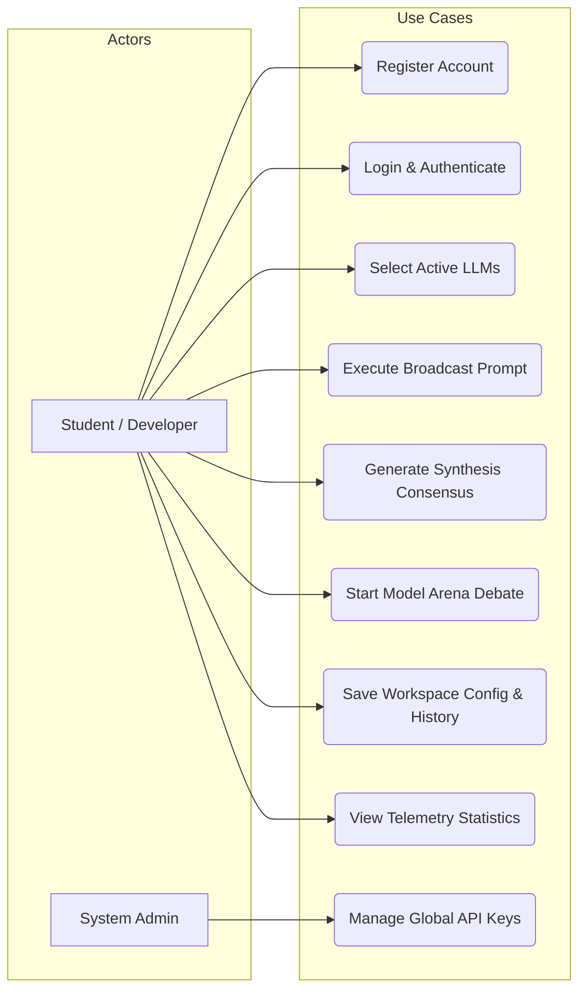
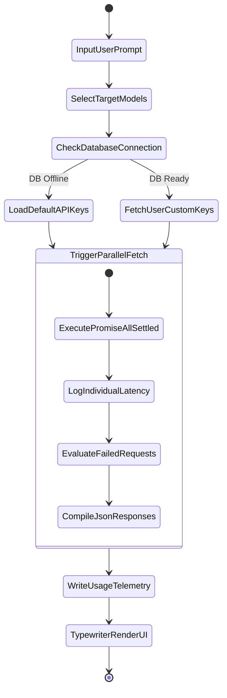
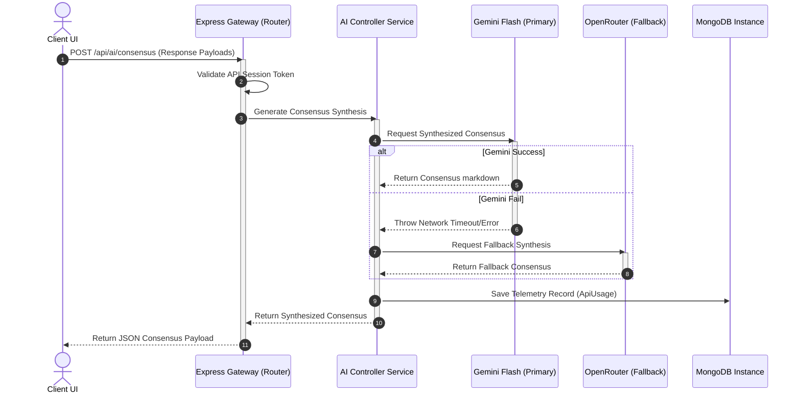

# MINI PROJECT-1 REPORT
## MULTI-AI: AN ENTERPRISE-GRADE MULTI-MODEL CONSENSUS & DEBATE WORKBENCH

---

### 1. TITLE PAGE

**Project Title:** MULTI-AI: An Enterprise-Grade Multi-Model Consensus & Debate Workbench  
**Document Type:** A Mini-Project-1 Report  
**Submission Requirement:** Submitted in partial fulfillment of the academic requirements for the award of the degree of  

### BACHELOR OF ENGINEERING IN INFORMATION TECHNOLOGY

**By Team Members:**
* **N. Tejeswar Reddy** (Roll No: 2451-24-737-131)
* **Shagun Gupta** (Roll No: 2451-24-737-164)
* **Siddhardha Vandrangi** (Roll No: 2451-24-737-184)

**Under the Guidance of:**
* **Mrs. G. Ushasri**  
  Sr. Assistant Professor  
  Department of Information Technology  

```
                      DEPARTMENT OF INFORMATION TECHNOLOGY
                             MVSR ENGINEERING COLLEGE
                            (An Autonomous Institution)
                     Nadergul, Saroornagar, Hyderabad - 501510
                                    2025-2026
```

---

### 2. COLLEGE CERTIFICATE, DECLARATION & ACKNOWLEDGEMENTS

#### 2.1 College Certificate
> **M.V.S.R ENGINEERING COLLEGE**  
> *(An Autonomous Institution, Affiliated to Osmania University)*  
> **DEPARTMENT OF INFORMATION TECHNOLOGY**
>
> This is to certify that the Mini Project-I work entitled **“MULTI-AI: An Enterprise-Grade Multi-Model Consensus & Debate Workbench”** is a bonafide work carried out by **Mr. N. Tejeswar Reddy (2451-24-737-131)**, **Ms. Shagun Gupta (2451-24-737-164)**, and **Mr. Siddhardha Vandrangi (2451-24-737-184)** in partial fulfillment of the requirements for the award of the degree of **Bachelor of Engineering in Information Technology** from M.V.S.R Engineering College, Hyderabad, during the Academic Year 2025-26 under our guidance and supervision.
>
> The results embodied in this report have not been submitted to any other university or institute for the award of any degree or diploma.
>
> **Internal Guide**  
> **Mrs. G. Ushasri**  
> Assistant Professor, Dept. of IT  
> MVSREC  
>
> **Project Co-ordinator**  
> **Mrs. J. Sowjanya**  
> Assistant Professor, Dept. of IT  
> MVSREC  
>
> **Head of Department**  
> **Dr. H. Rajesh Kulkarni**  
> Professor & Head, Dept. of IT  
> MVSREC  
>
> **External Examiner**  
> Dept of IT, MVSREC  

#### 2.2 Declaration
> We hereby declare that the work reported in this mini project entitled **“MULTI-AI: An Enterprise-Grade Multi-Model Consensus & Debate Workbench”** is a record of bonafide work done by us in the Department of Information Technology, M.V.S.R Engineering College, Hyderabad. 
> The report is based on the project work done entirely by us and has not been copied from any other source. The results in this project report have not been submitted to any other University or Institute for the award of any degree or diploma.
>
> * **N. Tejeswar Reddy** (2451-24-737-131)
> * **Shagun Gupta** (2451-24-737-164)
> * **Siddhardha Vandrangi** (2451-24-737-184)
>
> **Date:** 2026-06-27  
> **Place:** Hyderabad

#### 2.3 Acknowledgements
> We would like to express our sincere gratitude to our Project Guide, **Mrs. G. Ushasri**, Assistant Professor, for her valuable suggestions and feedback throughout the course of this project. We also thank our Project Coordinators, **Mrs. J. Sowjanya**, **Mrs. K. SriLakshmi**, and **Mrs. G. Ushasri**, for their recommendations and attention during the semester.
>
> We are also thankful to our Principal, **Dr. M. Kameswara Rao**, and **Dr. H. Rajesh Kulkarni**, Professor and Head of the Department of Information Technology, for providing the infrastructure and atmosphere to complete this project successfully as part of our B.E. Degree (IT).
>
> Finally, we thank the lab staff for their assistance and support, and our families for their encouragement.
>
> * **N. Tejeswar Reddy**  
> * **Shagun Gupta**  
> * **Siddhardha Vandrangi**  

---

### 3. VISION, MISSION, PEOs, POs & PSOs

#### 3.1 Vision of the Department
To impart technical education producing competent and socially responsible engineering professionals in the field of Information Technology.

#### 3.2 Mission of the Department
* **M1:** To make teaching learning process effective and stimulating.
* **M2:** To provide adequate fundamental knowledge of sciences and Information Technology with positive attitude.
* **M3:** To create an environment that enhances skills and technologies required for industry.
* **M4:** To encourage creativity and innovation for solving real world problems.
* **M5:** To cultivate professional ethics in students and inculcate a sense of responsibility towards society.

#### 3.3 Program Educational Objectives (PEOs)
After 3 to 4 years of graduation, graduates of the Information Technology program will:
* **PEO-I:** Apply knowledge of mathematics and Information Technology to analyze, design and implement solutions for real world problems in core or in multidisciplinary areas.
* **PEO-II:** Communicate effectively, work in a team, practice professional ethics and apply knowledge of computing technologies for societal development.
* **PEO-III:** Engage in Professional development or postgraduate education to be a life-long learner.

#### 3.4 Program Outcomes (POs)
1. **Engineering knowledge:** Apply the knowledge of mathematics, science, engineering fundamentals, and an engineering specialization to the solution of complex engineering problems.
2. **Problem analysis:** Identify, formulate, review research literature, and analyze complex engineering problems reaching substantiated conclusions using first principles of mathematics, natural sciences, and engineering sciences.
3. **Design/development of solutions:** Design solutions for complex engineering problems and design system components or processes that meet the specified needs with appropriate consideration for the public health and safety, and the cultural, societal, and environmental considerations.
4. **Conduct investigations of complex problems:** Use research-based knowledge and research methods including design of experiments, analysis and interpretation of data, and synthesis of the information to provide valid conclusions.
5. **Modern tool usage:** Create, select, and apply appropriate techniques, resources, and modern engineering and IT tools including prediction and modeling to complex engineering activities with an understanding of the limitations.
6. **The engineer and society:** Apply reasoning informed by the contextual knowledge to assess societal, health, safety, legal and cultural issues and the consequent responsibilities relevant to the professional engineering practice.
7. **Environment and sustainability:** Understand the impact of the professional engineering solutions in societal and environmental contexts, and demonstrate the knowledge of, and need for sustainable development.
8. **Ethics:** Apply ethical principles and commit to professional ethics and responsibilities and norms of engineering practice.
9. **Individual and team work:** Function effectively as an individual, and as a member or leader in diverse teams, and in multidisciplinary settings.
10. **Communication:** Communicate effectively on complex engineering activities with the engineering community and with society at large, such as, being able to comprehend and write effective reports and design documentation, make effective presentations, and give and receive clear instructions.
11. **Project management and finance:** Demonstrate knowledge and understanding of the engineering and management principles and apply these to one’s own work, as a member and leader in a team, to manage projects and in multidisciplinary environments.
12. **Life-long learning:** Recognize the need for, and have the preparation and ability to engage in independent and life-long learning in the broadest context of technological change.

#### 3.5 Program Specific Outcomes (PSOs)
* **PSO1: Hardware design:** An ability to analyze, design, simulate and implement computer hardware and software systems, including System-on-Chip (SOC) applications for various computing and communication system applications.
* **PSO2: Software design:** An ability to analyze a problem, design algorithm, identify and define the computing requirements appropriate to its solution and implement the same.

---

### 4. COURSE OBJECTIVES & OUTCOMES

#### 4.1 Course Objectives
Students should be able to:
* Define and clearly articulate the problem statement, project scope and objectives.
* Conduct a literature review to understand existing solutions, technologies and best practices related to the project.
* Design and develop a prototype or solution that addresses the problem statement and meets the specified requirements.
* Test and evaluate the performance, functionality, and reliability of the developed prototype.
* Document the project process and present the project findings to a panel of faculty members and peers.

#### 4.2 Course Outcomes
After completion of the course, students will be able to:
* **CO1:** Apply theoretical knowledge and technical skills acquired in previous coursework to solve a real-world engineering problem.
* **CO2:** Enhance problem-solving skills by analyzing the project requirements, identifying constraints, and proposing innovative solutions.
* **CO3:** Gain hands-on experience with engineering tools, software and equipment relevant to the project.
* **CO4:** Develop the ability to work effectively in a team, collaborate with peers, and allocate tasks to accomplish project goals.
* **CO5:** Improve communication skills through project documentation, presentations, and reports, and understand the ethical and professional responsibilities associated with engineering projects.

---

### 5. ABSTRACT
As generative AI model landscapes evolve, developers and technical managers face model selection challenges due to varying response quality, differences in latency, and distinct token-pricing structures. This project implements **Multi-AI**, a secure, multi-model consensus and debate workbench designed to evaluate and utilize multiple Large Language Models (LLMs) concurrently. 

Built using a Node.js/Express backend, MongoDB/Mongoose database layer, and a Vanilla HTML/CSS/JavaScript frontend, the system connects multiple AI services (including Gemini Flash, Groq Llama, Qwen, and Cohere) into a single, cohesive interface. 

The system features:
1. **Multi-Model Parallel Broadcast**: Queries are broadcasted simultaneously to selected models, measuring latency and logging telemetry.
2. **AI-Driven Consensus Engine**: Evaluates responses using a fallback Gemini/OpenRouter consensus synthesis loop to compile conflicting answers into a single output.
3. **AI Chatbot Arena**: Simulates debates between two models on user-defined topics, outputting a summary judged by a third model.
4. **Database Sync Integrity**: Custom settings, workspace configurations, and custom agent personas are synchronized using Mongoose bulk write operations (`bulkWrite`), preventing data loss.
5. **Bring Your Own Key (BYOK) Support**: Allows users to input custom credentials securely.

Through automated failovers and robust database schemas, Multi-AI demonstrates how full-stack applications can scale and integrate multiple AI providers reliably.

---

### INDEX

#### Table of Contents
* **Chapter 1: Introduction**
  * 1.1 Problem Statement
  * 1.2 Existing System
  * 1.3 Proposed System
  * 1.4 Scope
  * 1.5 Objectives
* **Chapter 2: System Requirement Specifications**
  * 2.1 Software Requirements
  * 2.2 Hardware Requirements
  * 2.3 System Architecture
* **Chapter 3: Design & Implementation**
  * 3.1 Features List
  * 3.2 Modules Description
  * 3.3 UML Diagrams
  * 3.4 Environmental Setup
  * 3.5 Implementation & Methodology Steps
* **Chapter 4: Results & Discussion**
  * 4.1 UI Screenshots
  * 4.2 Validation & Testing
* **Chapter 5: Conclusion & Future Enhancements**
  * 5.1 Conclusion
  * 5.2 Future Enhancements
* **References**
* **Appendix: Source/Pseudo Code**

#### List of Abbreviations
* **HTML:** HyperText Markup Language
* **CSS:** Cascading Style Sheets
* **JS:** JavaScript
* **API:** Application Programming Interface
* **NoSQL:** Not Only SQL (Database type)
* **JWT:** JSON Web Token
* **UI/UX:** User Interface / User Experience

---

### CHAPTER 1: INTRODUCTION

#### 1.1 Problem Statement
In the current LLM landscape, no single model is ideal for every task. Some models offer low latency, while others excel at complex reasoning. Developers must manually test prompts across multiple playgrounds, which is time-consuming and leads to unstructured comparison records. 

Additionally, combining outputs from different providers presents technical challenges:
* **Overhead**: Writing boilerplate code for multiple APIs.
* **Reliability**: Managing varying rate limits, timeouts, and authorization structures.
* **Security**: Storing API keys securely while supporting user-provided keys (BYOK).

**Multi-AI** solves this by providing a unified workspace to compare, evaluate, and combine model outputs. It consolidates multiple integrations into a single interface, offering structured side-by-side chat panels, consensus generators, automated multi-turn debates, and session telemetry.

#### 1.2 Existing System
* **Manual Comparison**: Testing prompts across multiple model playgrounds is time-consuming.
* **Scattered APIs**: Lacks a unified system to handle varying API client dependencies, request formats, and rate limits.
* **Security Risks**: No secure system to let users provide their own keys (BYOK) for development purposes without exposure.
* **No Telemetry Tracking**: Systems do not track query latency, tokens, or costs across distinct providers.
* **Destructive Overwrites**: History synchronization often relies on clearing and reinserting records, which can cause data loss.

#### 1.3 Proposed System
Our proposed system, **Multi-AI**, introduces a unified platform that connects multiple AI models into a single workspace, allowing side-by-side execution, debate loops, and consensus summaries. Key features include:
* **Parallel Query Broadcast**: Sends requests to multiple models concurrently and tracks latency.
* **Consensus Synthesis Loop**: Compiles different model outputs into a single, optimized summary.
* **AI Chatbot Arena**: Simulates debates between two models on a topic, summarized by a third model.
* **Resilient Sync Engine**: Uses Mongoose `bulkWrite` operations to sync history and configurations safely.
* **Credential Vault**: Supports both environment-defined keys and user-supplied credentials (BYOK).

#### 1.4 Scope
The scope of the Multi-AI project focuses on providing a structured digital solution for multi-model LLM interaction and analysis. The system supports users in executing parallel queries, configuring custom system personas, evaluating consensus outputs, and simulating model debates, all within a single web-based interface. It operates as a full-stack platform that delivers live telemetry records and secures credentials. This platform is intended for developer labs, prompt engineers, and researchers seeking systematic AI outputs comparisons.

#### 1.5 Objectives
* **Consolidate APIs**: Integrate multiple AI providers (Gemini, Llama, Cohere, etc.) into a single, unified workspace.
* **Synthesize Consensus**: Build a consensus loop to compile different model outputs into a single response.
* **Simulate Model Debates**: Create an arena mode for multi-turn debates between different models to analyze conflicting arguments.
* **Minimize Latency Bottlenecks**: Implement parallel execution models to prevent slow APIs from blocking others.
* **Optimize Sync Integrity**: Protect user workspace histories and settings using differential bulk operations.

---

### CHAPTER 2: SYSTEM REQUIREMENT SPECIFICATIONS

#### 2.1 Software Requirements
* **Frontend**: HTML5, CSS3, JavaScript for UI components, along with responsive layouts for dashboards and comparison panels.
* **Scripting**: Client-side JavaScript for handling panels generation, interactive analytics charts, and input validations.
* **Backend**: Node.js and Express.js for routing, REST APIs, user authentication, and API key decryption.
* **Database**: MongoDB for storing user profiles, chat history (Conversations), settings, and telemetry (ApiUsage).
* **AI Integration**: Gemini API, OpenRouter, Groq, and Cohere APIs for parallel execution.
* **Development Tools**: Visual Studio Code editor, Git version control, and Postman client.

#### 2.2 Hardware Requirements
* **Processor**: Intel Core i3 (or equivalent AMD processor) or higher.
* **RAM**: Minimum 4 GB (8 GB recommended for concurrent backend, database, and browser executions).
* **Storage**: At least 10 GB of free disk space for project files, dependencies, and database storage.
* **Network**: Active internet connection for API integration, database hosting, and dependencies.
* **Display**: Full HD (1920×1080) for interface responsiveness and layout testing.

#### 2.3 System Architecture
The architecture follows a Model-View-Controller (MVC) pattern, decoupling the client UI from the backend services and MongoDB database layer.


*Figure 2.1: Multi-AI Three-Tier System Architecture*

---

### CHAPTER 3: DESIGN & IMPLEMENTATION

#### 3.1 Features List
* **User Profile Module**: Manages academic backgrounds, current skill sets, and career preferences.
* **Parallel Query Broadcast**: Sends requests to multiple selected models concurrently and tracks latency.
* **Consensus Synthesis Loop**: Compiles different model outputs into a single, optimized summary.
* **AI Chatbot Arena**: Simulates debates between two models on a topic, summarized by a third model.
* **Resilient Sync Engine**: Uses Mongoose `bulkWrite` operations to sync history and configurations safely.
* **Telemetry & Tele-Analytics Logger**: Logs and visualizes latency, token counts, and cost estimates.
* **Secure Authentication**: Implements encrypted login and secure session management.
* **Bring Your Own Key (BYOK) Support**: Allows users to input custom API credentials.

---

#### 3.2 Modules Description

##### 1. User & Profile Module
Manages user accounts, login, and registration. It hashes passwords using bcrypt and generates JWT tokens for secure authentication. It also stores user profiles, including academic details, current skills, and career preferences.

##### 2. Parallel AI Broadcast Module
Receives the user prompt and a list of active models. It constructs the appropriate system prompts and sends the requests concurrently using `Promise.allSettled`. This approach prevents slow or failing endpoints from blocking other models.

##### 3. AI Consensus & Rating Engine
Lets users vote (like/dislike) on responses to log preferences in the database. The Consensus Module compiles outputs from different models and generates a synthesized answer. It queries the Gemini API first, with an automated fallback to OpenRouter if the primary API fails.

##### 4. Workspace State Synchronization Module
Synchronizes UI settings, custom personas, and chat history. To optimize performance and prevent data loss, the module uses Mongoose bulk writes (`bulkWrite`) with upserts, replacing destructive teardown patterns (`deleteMany` + `insertMany`).

##### 5. Telemetry & Tele-Analytics Logger
Logs metrics (such as response latency, success status, and active models) for each request. These logs are stored in the `apiusages` collection and aggregated to display performance stats in the UI.

---

#### 3.3 UML Diagrams

##### Use Case Diagram

*Figure 3.1: Multi-AI Use Case Diagram*

##### Activity Diagram (Broadcast Chat Workflow)

*Figure 3.2: Activity Diagram for Parallel Query Broadcast*

##### Sequence Diagram (Consensus Synthesis Loop)

*Figure 3.3: Sequence Diagram for Consensus Synthesis Loop*

---

#### 3.4 Environmental Setup

##### Installation of Editor: Visual Studio Code
1. Open your browser and navigate to `code.visualstudio.com`.
2. Click the download button for Windows (Windows x64 version).
3. Open the downloaded installer file.
4. Accept the license agreement and click **Next**.
5. Choose the installation directory or leave it at the default location, then click **Next**.
6. Select additional options (such as creating a desktop icon and adding VS Code to the system path), then click **Next**.
7. Click **Install** to begin the installation.
8. Once complete, select the launch option and click **Finish**.

##### Installing extensions in VS Code:
* Open the Extension Market on the left sidebar (shortcut: `Ctrl+Shift+X`).
* Search for **Live Server** (by Ritwick Dey) and click **Install**.
* Search for **Prettier - Code formatter** (by Prettier) and click **Install**.

---

#### 3.5 Implementation & Methodology Steps

##### 1. Front-End Interface Design
* Design responsive dashboards with comparison panels for multi-model views using HTML5/CSS3.
* Create a side menu layout and overlay modals for settings, personas, and telemetry.
* Bind event listeners for input submissions and prompt broadcasts.

##### 2. User Authentication & Session Control
* Build registration, login, and profile controllers with secure encryption.
* Issue signed JSON Web Tokens (JWT) for user authorization and session security.
* Setup request header parsing inside custom JWT verification middleware.

##### 3. Parallel AI Broadcast Implementation
* Create Express API routes to handle prompt submissions.
* Map model names to their respective service interfaces (Gemini, Groq, Cohere, etc.).
* Run queries concurrently using asynchronous routing and `Promise.allSettled`.

##### 4. AI Consensus & Arena Debate Loop
* Integrate the Gemini API as a primary engine for consensus synthesis.
* Code the debate loop to iterate arguments between two models and save history dynamically.
* Implement a fallback structure using OpenRouter when primary API exceptions occur.

##### 5. Workspace Synchronization & Telemetry Logging
* Configure the history and settings sync APIs using differential bulk write (`bulkWrite`) operations.
* Log request latency, active models, and success status details in the database.
* Compile telemetry logs into simple analytics reports for the user.

---

### CHAPTER 4: RESULTS & DISCUSSION

#### 4.1 UI Screenshots

##### Figure 4.1: Multi-AI Workspace Dashboard Mockup


---

#### 4.2 Validation & Testing

The system underwent manual integration testing. The test cases and results are detailed in the matrix below.

| Test ID | Module | Test Scenario / Description | Inputs | Expected Output | Actual Output | Status |
| :--- | :--- | :--- | :--- | :--- | :--- | :--- |
| **TC-1** | Core Load | Ensure home page and sidebar render successfully | Open Multi-AI URL | Dashboard renders with active comparison panels and settings | Home page loaded with correct brand styles | **PASS** |
| **TC-2** | Auth | Verify secure login for student and admin roles | Valid email/password credentials | Session validates and redirects to the correct dashboard | JWT verified; user redirected to dashboard | **PASS** |
| **TC-3** | Broadcast | Validate parallel prompt execution across multiple LLMs | Select Gemini and Groq, submit prompt | Both model panels render responses alongside latency stats | Responses generated; latency logged in database | **PASS** |
| **TC-4** | Consensus | Verify consensus synthesis fallback path | Click "Generate Consensus" with missing Gemini Key | System falls back to OpenRouter to output consensus summary | OpenRouter fallback executed successfully | **PASS** |
| **TC-5** | Debate | Simulate model debate loop step | Start debate on "CSS Grid vs Flexbox" | Turn history updates with alternating model responses | Alternate responses logged and rendered | **PASS** |
| **TC-6** | Sync | Ensure differential history sync without database data loss | Modify chat title and trigger sync | Database updates the specific title without deleting history | Verified in MongoDB; title updated without loss | **PASS** |
| **TC-7** | Telemetry | Verify aggregation of API usage records | Navigate to the "Analytics" tab | Aggregate latency metrics table renders on screen | Table renders latency averages by model | **PASS** |
| **TC-8** | UI | Test responsiveness of the panel layout grid | Toggle 1, 2, or 3 panels | Layout grid updates columns dynamically | Grid columns adjusted dynamically | **PASS** |
| **TC-9** | Session | Ensure secure session termination on logout | Click logout button | Session clears and redirects to the login screen | Session cleared and redirected to login | **PASS** |

*Table 4.1: System Test Matrix*

---

### CHAPTER 5: CONCLUSION & FUTURE ENHANCEMENTS

#### 5.1 Conclusion
Multi-AI provides a unified, secure workbench for comparing and synthesizing outputs from multiple Large Language Models. 

By using parallel asynchronous routing on the backend and Mongoose bulk writes (`bulkWrite`) for database operations, the application prevents data loss and maintains high performance under concurrent write loads. 

The fallback architecture ensures the consensus engine remains available even when primary API providers fail. The project demonstrates a production-ready implementation of model orchestration and session management.

#### 5.2 Future Enhancements
* **Stream-Based Response Typing**: Implement Server-Sent Events (SSE) to render model outputs in real-time.
* **Granular Role-Based Access Control (RBAC)**: Add admin dashboards to configure rate limits, monitor system usage, and manage API keys globally.
* **Vector Embeddings Database (RAG Integration)**: Integrate a vector database (such as Pinecone or Milvus) to let users search through their chat history using semantic queries.

---

### REFERENCES
1. **Node.js Documentation**: *Asynchronous Event-Driven Javascript Runtimes*, NodeJS Foundation (https://nodejs.org/docs).
2. **Express.js Guide**: *Routing, Middleware Integration and Rate-Limiting Design* (https://expressjs.com).
3. **Mongoose Documentation**: *Schema Definition, Bulk Writes and Indexing Rules* (https://mongoosejs.com).
4. **Google Gemini API Documentation**: *Generative Language REST Integration Guide* (https://ai.google.dev/docs).
5. **OpenRouter API Specs**: *Unified REST Endpoints for AI Model Selection* (https://openrouter.ai/docs).
6. **LMSYS Chatbot Arena**: *Elo Rating Systems and Comparative Evaluation Methodologies for Large Language Models* (https://chat.lmsys.org).
7. **Osmania University IT Syllabus**: *Guidelines for BE Information Technology Mini-Project Course Evaluation* (https://osmania.ac.in).

---

### APPENDIX: SOURCE / PSEUDO CODE

#### 1. Database-Resilient History Sync Logic (`backend/routes/workspace.routes.js`)
```javascript
router.put('/history', async (request, response) => {
  try {
    if (!ensureDatabase(response)) return;
    const conversations = Array.isArray(request.body.conversations) ? request.body.conversations.slice(0, 100) : [];
    const owner = ownerQuery(request);
    const ownerFields = getOwnerFields(request);
    
    const clientLocalIds = conversations.map(chat => String(chat.id || chat.localId || ''));

    // 1. Delete conversations no longer present in the client payload
    await Conversation.deleteMany({
      ...owner,
      localId: { $nin: clientLocalIds }
    });

    // 2. Perform bulkWrite upserts for remaining items
    if (conversations.length > 0) {
      const ops = conversations.map(chat => {
        const localId = String(chat.id || chat.localId || '').slice(0, 120);
        return {
          updateOne: {
            filter: { ...owner, localId },
            update: {
              $set: {
                title: String(chat.title || 'Untitled Chat').slice(0, 120),
                isPinned: Boolean(chat.isPinned),
                activeModels: Array.isArray(chat.activeModels) ? chat.activeModels.slice(0, 10).map(String) : [],
                timestamp: chat.timestamp ? new Date(chat.timestamp) : new Date(),
                messages: chat.messages && typeof chat.messages === 'object' ? chat.messages : {},
                ...ownerFields
              }
            },
            upsert: true
          }
        };
      });
      await Conversation.bulkWrite(ops);
    }

    const saved = await Conversation.find(owner).sort({ updatedAt: -1 }).limit(100).lean();
    response.json({ success: true, conversations: saved });
  } catch (error) {
    console.error('History save error:', error);
    response.status(500).json({ success: false, message: 'Failed to save history.' });
  }
});
```

#### 2. Fallback Engine Consensus Synthesis Loop Implementation (`backend/services/auxiliary.service.js`)
```javascript
import { askGemini } from './gemini.service.js';
import { askOpenRouter } from './openrouter.service.js';
import { askCohere } from './cohere.service.js';
import { askGroq } from './groq.service.js';

export async function askGeminiWithFallback(prompt, fallbackModel = 'google/gemini-2.5-flash', customKeys = {}) {
  const keys = customKeys || {};
  try {
    const response = await askGemini(prompt, keys.GEMINI_API_KEY);
    if (response === 'Model unavailable') {
      throw new Error('Gemini returned unavailable');
    }
    return { response, fallbackUsed: false };
  } catch (err) {
    console.warn('Gemini request failed, falling back to OpenRouter:', err.message || err);
    try {
      const response = await askOpenRouter(prompt, fallbackModel, keys.OPENROUTER_API_KEY);
      return { response, fallbackUsed: true };
    } catch (fallbackErr) {
      console.error('OpenRouter fallback also failed:', fallbackErr.message || fallbackErr);
      try {
        const response = await askCohere(prompt, keys.COHERE_API_KEY);
        if (response && response !== 'Model unavailable') {
          return { response, fallbackUsed: true };
        }
      } catch (cohereErr) {
        console.error('Cohere fallback also failed:', cohereErr.message || cohereErr);
      }

      try {
        const response = await askGroq(prompt, keys.GROQ_API_KEY);
        if (response && response !== 'Model unavailable') {
          return { response, fallbackUsed: true };
        }
      } catch (groqErr) {
        console.error('Groq fallback also failed:', groqErr.message || groqErr);
      }

      return { response: 'Judge service unavailable. Please try again shortly.', fallbackUsed: true };
    }
  }
}
```

---

### M.V.S.R ENGINEERING COLLEGE
**(An Autonomous Institution)**  
**Department of Information Technology**  

#### MINI Project-1 Evaluation Sheet

**Section I: (To be filled by the Student)**  
* **Roll Number:** \_\_\_\_\_\_\_\_\_\_\_\_\_\_\_\_\_\_  
* **Name of Student:** \_\_\_\_\_\_\_\_\_\_\_\_\_\_\_\_\_\_  
* **Name of Supervisor:** Mrs. G. Ushasri  
* **Title:** MULTI-AI: An Enterprise-Grade Multi-Model Consensus & Debate Workbench  

**Section II: (To be filled by the Supervisor)**  
Comments on the Mini Project by the Supervisor:  

**1. Quantum of work**  
* Justifiable as efforts for Semester duration: **Yes / No**  
* Work is in line with the commitments made in outline: **Yes / No**  

**2. Nature of work**  
* Routine in nature: **Yes / No**  
* Involved creativity and rational thinking: **Yes / No**  

**3. Evaluation methodology**  
* Evaluation done based on presentation to supervisor: **Yes / No**  
* Student regularly interacted with supervisor and incorporated the suggestions made: **Yes / No**  

**4. Mini Project evaluation matrix**  
*(Tick the appropriate box: 1 is lowest and 5 is the highest)*  

| Dimension | Rank 1 | Rank 2 | Rank 3 | Rank 4 | Rank 5 |
| :--- | :---: | :---: | :---: | :---: | :---: |
| **Communication ability** | | | | | |
| **Organization of material** | | | | | |
| **Response to review questions** | | | | | |
| **Report structure and format** | | | | | |
| **Technical content of the report** | | | | | |
| **Explanation on the significance of the assignment** | | | | | |
| **Analysis of alternative approaches** | | | | | |
| **Recommendation and suggestions** | | | | | |
| **Discussion on benefits and limitations** | | | | | |
| **Understanding of the subject of Mini Project** | | | | | |
| **Creative thinking ability to come up with new ideas** | | | | | |
| **Report submitted** | | | | | |
| **Viva / Seminar presentation** | | | | | |

* **Student abilities in general:** \_\_\_\_\_\_\_\_\_\_\_\_\_\_\_\_\_\_\_\_\_\_\_  
* **Any other comments:** \_\_\_\_\_\_\_\_\_\_\_\_\_\_\_\_\_\_\_\_\_\_\_\_\_\_\_\_  

**Date:** \_\_\_\_\_\_\_\_\_\_  
**Signature of Supervisor:** \_\_\_\_\_\_\_\_\_\_\_\_\_\_\_\_\_\_  
